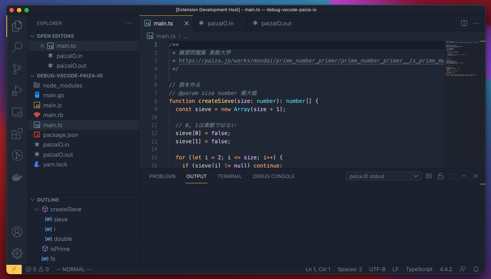

# vscode-paiza-io README

paizaIO for VSCode.

## Features

###
1. Open command palette.
2. run command `paizaIO: Run code on paiza.IO`

### stdin
create `paizaIO.in` plaintext file.

### diff judge
create `paizaIO.out` plaintext file.

## Release Notes

### 0.1.0

beta release.
