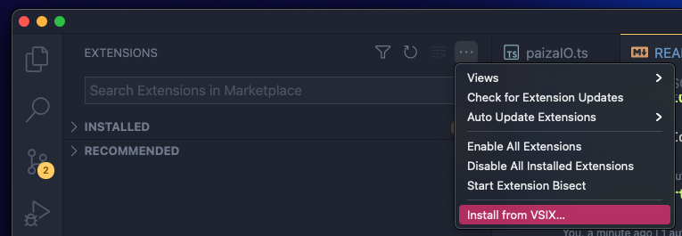

# VSCode PaizaIO

paizaIO for VSCode Extension.

## Getting Started

### VSCode market place

coming soon...

### Manual install

[Releases](https://github.com/s10akir/vscode-paiza-io/releases/latest) より最新の Release から `Assets` > `vscode-paiza-io-x.x.x.vsix` をダウンロードし、VSCode の拡張機能設定より VSXi からのインストールを行ってください。

## Feature

### Run code on paiza.IO

[paiza.IO](https://paiza.io/) へ接続できるネットワーク環境が必要です。

実行したいコードを開いた状態で VSCode のコマンドパレット（Windows/Linux: `Shift+Ctrl+P` mac: `Shift+Command+P`）を開き `Run Code on paiza.IO` を選択することで paiza.IO 上でコードが実行されます。

### stdin

paizaIO での実行時に標準入力を引き渡すことができます。

VSCode で開いているワークスペースの最上位ディレクトリに `paizaIO.in` というファイルを設置することで、paizaIO での実行時に内容が標準入力として引き渡されます。  
※ 現時点ではワークスペースの最上位ディレクトリに配置されている場合のみに対応しています。

サンプルは `https://github.com/s10akir/vscode-paiza-io/tree/main/docs/examples` を参照してください。

### diff judge

paizaIO の標準出力結果を用いて簡易的な diff judge を行うことができます。

VSCode で開いているワークスペースの最上位ディレクトリに `paizaIO.out` というファイルを設置することで、paizaIO での実行時に得られた標準出力の内容との一致を比較した judge 結果を出力します。  
※ 現時点ではワークスペースの最上位ディレクトリに配置されている場合のみに対応しています。

サンプルは `https://github.com/s10akir/vscode-paiza-io/tree/main/docs/examples` を参照してください。

---

## LICENSE

MIT License

Copyright (c) 2021 Akira Shinohara

## Release Notes

### 0.1.0

beta release.
